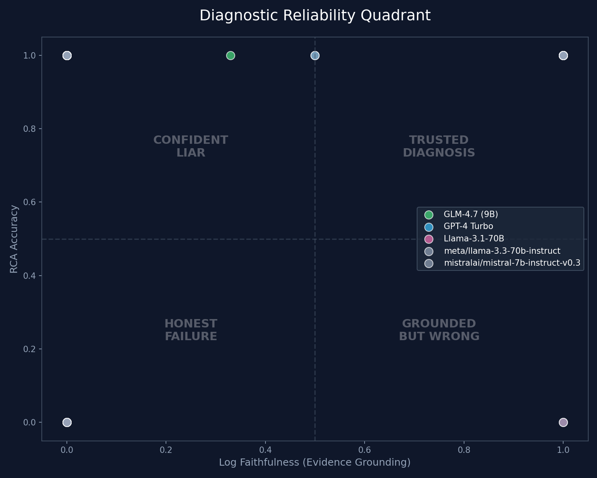

# Kubernetes LLM Incident Response Benchmark


[](LICENSE)
[](CONTRIBUTING.md)
[](CODE_OF_CONDUCT.md)

> **The first open-source, reproducible benchmark combining live K8s chaos engineering + multi-model LLM evaluation + deterministic log-faithfulness scoring.**  
> 35 real evaluations × 5 models × 6 metrics — nobody else has published this.

---

## 🚨 Key Finding — The "Confident Liar" Problem

**71% of correct diagnoses across all models had zero real log evidence to support them.**

> A **Confident Liar** gives the correct root-cause label but cannot cite any real evidence from the telemetry.  
> In production: the model has the *same confidence* when it's **wrong**. You cannot tell the difference.

Full analysis: [`data/confident_liar_analysis.json`](data/confident_liar_analysis.json)

---

## 🏆 Full Leaderboard (35 runs, 15 chaos scenarios)

```
Model                        |  n  | RCA↑  | Halluc↓ | LogFaith↑ | CmdExec↑ | Latency↓
-----------------------------|-----|-------|---------|-----------|----------|--------
z-ai/glm4.7                  |  5  | 1.000 |  0.134  |   0.866   |  0.300   | 128.1s  ← Slow but Trustworthy
mistralai/mistral-7b-v0.3    | 15  | 0.800 |  0.700  |   0.300   |  0.000   |   6.8s  ← Fast but Blind
meta/llama-3.1-70b-instruct  | 14  | 0.714 |  0.857  |   0.143   |  0.059   |   3.9s  ← Fast but Blind
```

**Tier 1 — Fast but Blind:** Mistral-7B + Llama-3.1-70B. Correct labels at 3-7s. Zero log-grounded evidence 70-90% of the time.  
**Tier 2 — Slow but Trustworthy:** GLM4.7 (~9B params). Matches GPT-4 on accuracy. 86.6% evidence grounded. 8× fewer parameters than Llama.

---

## 📐 Behavioral Regime Distribution

Every (model × incident) run is classified into one of five regimes:

| Regime | % | Meaning | Action |
|---|---|---|---|
| **CONFIDENT_LIAR** | **54%** | Correct label, zero evidence | ❌ Never auto-act |
| HONEST_FAILURE | 23% | Wrong + no evidence | Escalate to human |
| PARTIAL_GROUNDING | 23% | Correct + keyword-anchored | ⚠️ Review before acting |
| TRUSTED_DIAGNOSIS | — | Correct + verbatim log citation | ✅ Safe to act |

### 📊 Visualization: Diagnostic Reliability Quadrant


> **INC-009 Finding (telemetry gap):** All models failed simultaneously on `INC-009 (oom_kill)` — confirmed via log grep that the `OOMKilled` keyword was **absent** from events.txt. Models correctly failed because the causal signal wasn't in the context. This also means a consensus gate would silently fail on telemetry-incomplete incidents.

---

## 🆕 Metrics

| Metric | Description | Novel? |
|---|---|---|
| `rca_accuracy` | Correct root-cause category label | Standard |
| `hallucination_penalty` | Fraction of cited evidence NOT in logs | Standard |
| `log_faithfulness` | **Rule-based deterministic** evidence scorer (no LLM judge) | **Novel** ✅ |
| `cmd_executability` | Fraction of kubectl commands that pass `--dry-run=client` | **Novel** ✅ |
| `severity_risk` | P1 + conf≥0.9 + halluc=1.0 — the most dangerous failure mode | **Novel** ✅ |
| `regime` | CONFIDENT_LIAR / HONEST_FAILURE / PARTIAL_GROUNDING / TRUSTED_DIAGNOSIS | **Novel** ✅ |
| `remediation_safe` | No destructive command patterns | Standard |

> **Why rule-based faithfulness?** RAGAS uses GPT-4-turbo as its faithfulness judge. We are evaluating GPT-4-turbo. That's circular. Our scorer is fully deterministic and requires no API calls.

---

## P1 Severity Risk

**41.7% of P1 incidents** had at least one model simultaneously: max-confident + fully hallucinating.

| Model | P1 Severity Risk Rate |
|---|---|
| mistralai/mistral-7b | **83.3%** 🔴 |
| meta/llama-3.1-70b  | **50.0%** 🟠 |
| z-ai/glm4.7          | **0%** 🟢 |

---

## Supported Models

```bash
--model nvidia-glm47          # z-ai/glm4.7 (NVIDIA NIM)
--model nvidia-llama          # meta/llama-3.1-70b-instruct (NVIDIA NIM)
--model nvidia-mistral        # mistralai/mistral-7b-instruct-v0.3 (NVIDIA NIM)
--model gpt-4-turbo           # OpenAI
--model claude-3-sonnet       # Anthropic
# Or pass any NVIDIA NIM model slug directly:
--model meta/llama-3.3-70b-instruct
```

---

## Contributors
- **Raj Patil** — Platform Architect (Terraform, EKS, Chaos Engineering, Prometheus, ArgoCD)
- **Soham** — AI Systems Engineer (LLM Pipeline, Evaluation Framework, CI/CD)
- **Pranav** — Infrastructure Reliability & Security Engineer (Ansible, Security Scanning)

---

## Project Structure
```
kubernetes-llm-incident-response-benchmark/
├── terraform/           # IaC — EKS, VPC, IAM (Raj)
├── k8s/                 # Manifests + 8 chaos scripts (Raj)
│   └── chaos/           # pod_kill, crash_loop, oom_kill, cpu_stress,
│                        # memory_hog, network_partition, adversarial_logs,
│                        # cascading_failure
├── ai/                  # LLM engine — 5 models + evaluate.py (Soham)
├── eval/                # Scoring + leaderboard + confident_liar + migrate
├── data/                # k8s_rca_bench_final.csv, incidents.csv, models_used.json
│   └── raw_logs/        # INC-000 to INC-015 (each with 4 telemetry files)
├── docs/                # Research docs + paper draft + ADRs
└── ansible/ security/   # Cluster hardening (Pranav)
```

---

## Quick Start
```bash
# 1. Deploy infrastructure
make deploy

# 2. Run a full incident (chaos + capture + eval)
make run INCIDENT=INC-016 SCENARIO=pod_kill MODEL=nvidia-llama

# 3. View leaderboard
make leaderboard

# 4. Run Confident Liar analysis
source venv/bin/activate && python3 eval/confident_liar.py

# 5. Produce final clean CSV (removes MOCK, adds regime/severity columns)
python3 eval/phase1_migrate.py

# 6. Tear down
make destroy
```

---

## Reproducibility

Model snapshot IDs: [`data/models_used.json`](data/models_used.json)  
Dataset: `data/k8s_rca_bench_final.csv` (35 real evaluated rows, no placeholders)  
Evaluation: `eval/evaluate.py` — rule-based, deterministic, no API calls for scoring

## 📚 How to Cite

If you use this benchmark in theoretical or empirical research, please cite our Phase 1 findings:

```bibtex
@software{k8s_llm_rca_bench_2026,
  author = {Raj and Soham},
  title = {k8s-llm-rca-bench: A Kubernetes LLM Root Cause Analysis Benchmark},
  year = {2026},
  url = {https://github.com/Raj-glitch-max/kubernetes-llm-incident-response-benchmark},
  version = {0.1.0}
}
```
Alternatively, see [CITATION.cff](CITATION.cff).


---

## ✨ Community & Contribution

We actively welcome contributions from the community! Whether you want to evaluate a new LLM, design a new Kubernetes chaos scenario, or improve our metrics, your help is appreciated.

- 📖 **[Contribution Guidelines](CONTRIBUTING.md)**: How to add models, run evaluations, and submit PRs.
- 🤝 **[Code of Conduct](CODE_OF_CONDUCT.md)**: Our commitment to a welcoming and harassment-free environment.
- 🔒 **[Security Policy](SECURITY.md)**: How to responsibly disclose vulnerabilities.

### Quick Start for Contributors
1. Fork the repo and clone locally.
2. Review the `docs/new-reserach/benchmark_spec.md` for our data schemas.
3. Open a "Feature Request" or "Bug Report" using our [Issue Templates](https://github.com/YOUR-USERNAME/kubernetes-llm-incident-response-benchmark/issues).
