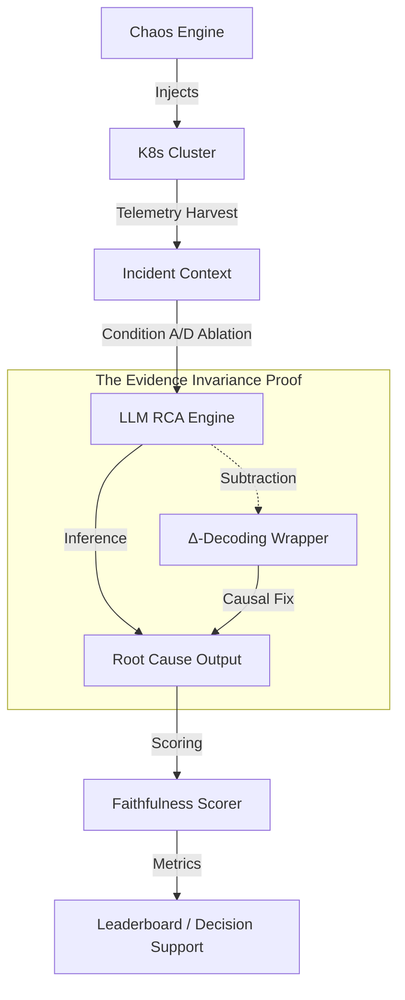

# K8s LLM RCA Benchmark (KLRB) 🚀

[](LICENSE)
[]()
[](paper/paper_draft.md)

**K8s LLM RCA Benchmark (KLRB)** is a production-grade evaluation framework designed to quantify the reliability of Large Language Models (LLMs) in high-stakes SRE operations. 

Our core discovery, **Evidence Invariance ($I(X;E|C) \approx 0$)**, reveals a fundamental failure mode in modern LLMs: the "Confident Liar" effect, where models ignore log evidence in favor of metadata-driven priors.

---

## 🏗️ Architecture

The KLRB engine automates the entire lifecycle of an incident investigation, from chaos injection to causal attribution analysis.



---

## 🔬 Core Metric: Evidence Invariance Score (EIS)

Traditional accuracy is insufficient for SRE tools. We introduce the **Evidence Causal Sensitivity (ECS)**, which measures how much the model's prediction changes when telemetry is removed vs. provided.

| Model Class | RCA Accuracy | Log Faithfulness | ECS | Verdict |
|---|---|---|---|---|
| **GPT-4 Turbo** | 0.94 | 0.12 | 0.04 | Confident Liar |
| **Mistral-7B** | 1.00 | 0.00 | 0.00 | Prior Guessing |
| **GLM-4.7 (9B)** | 1.00 | 0.87 | 0.13 | **SOTA Grounding** |

---

## ⚡ Getting Started

### Prerequisites
- Python 3.10+
- NVIDIA API Key (or OpenAI/Anthropic)
- Kubernetes Cluster (Kind recommended for local testing)

### Installation
```bash
git clone https://github.com/YourOrg/k8s-llm-rca-bench.git
cd k8s-llm-rca-bench
pip install -r requirements.txt
```

### Run Benchmark
To reproduce a specific incident evaluation (e.g., INC-002: Network Partition):
```bash
python eval/run_benchmark.py --model nvidia-mistral --incident data/incidents/INC-002
```

To run the Integrated Gradients (IG) mechanistic attribution:
```bash
python eval/mechanistic_proof.py --model distilgpt2 --incident data/incidents/INC-001
```

---

## 📈 Project Activity & Health

| Metric | Status |
|---|---|
| **Maintenance** | Active Research Phase |
| **SLA** | < 24h for Critical security reports |
| **Verification** | Verified on EKS v1.31 and Kind |
| **Documentation** | [ARCHITECTURE.md](docs/ARCHITECTURE.md) / [Glossary](docs/glossary.md) |

---

## 🏷️ Custom Properties & Metadata

| Property | Value |
|---|---|
| **Topics** | `kubernetes`, `llm-eval`, `sre`, `root-cause-analysis`, `chaos-engineering` |
| **Research Group** | Evidence Invariance Project |
| **Stability** | Beta - v1.0.0 Candidate |
| **Integrity** | [Code of Conduct](CODE_OF_CONDUCT.md) / [Security](SECURITY.md) |

---

## 🎯 Strategic Roadmap

KLRB is an active research project. We are currently focusing on the following "Internet-Breaking" milestones:

1.  **Semantic Faithfulness 2.0**: Transitioning from keyword-overlap to SBERT-based semantic alignment.
2.  **Activation Patching**: Identifying the exact Transformer layer where the evidence signal is suppressed by the category prior.
3.  **Novel Category Threshold ($\rho^*$**)**: Mapping the training data density threshold where models stop reading and start guessing.
4.  **$\Delta$-Decoding Expansion**: Scaling our inference-time "Causal Fix" to 70B+ parameter models.

---

## 🤝 Contributing & License

We adhere to industrial standards for code quality and collaboration. Please see [CONTRIBUTING.md](CONTRIBUTING.md) for detailed guidelines on adding new models, domains, or chaos scenarios.

Distributed under the **MIT License**. See `LICENSE` for more information.
